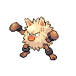

# Primeape

{ align=left }

| Information | Value |
|------------|--------|
| Name | Primeape |
| Category | Pig Monkey Pokémon |
| Types | Fighting |
| Gender Ratio | 50% Male |
| Catch Rate | 75 |

## Base Stats

| Stat | Value |
|------|-------|
| HP | 65 |
| Attack | 115 |
| Defense | 60 |
| Sp. Attack | 60 |
| Sp. Defense | 70 |
| Speed | 115 |
| BST | 485 |

## Abilities
1. Vital Spirit

## Level Up Moves
| Level | Move |
|-------|------|
| 1 | Triple Axel |
| 1 | Leer |
| 1 | Low Kick |
| 1 | Dragon Pulse |
| 9 | Low Kick |
| 15 | Snarl |
| 21 | Fury Swipes |
| 27 | Focus Energy |
| 28 | Dragon Pulse |
| 36 | Seismic Toss |
| 45 | Cross Chop |
| 54 | Screech |
| 63 | Thrash |

## Evolution
- Evolved from [Mankey](056-mankey.md) at level 28

!!! note "Notable TMs"
    - TM01 (Focus Punch)
    - TM03 (Swagger)
    - TM06 (Toxic)
    - TM07 (Rock Slide)
    - TM08 (Bulk Up)
    - TM09 (Psych Up)
    - TM12 (Taunt)
    - TM20 (Power-Up Punch)
    - TM24 (Thunderbolt)
    - TM25 (Thunder)
    - TM26 (Earthquake)
    - TM28 (Dig)
    - TM31 (Brick Break)
    - TM32 (Poison Jab)
    - TM39 (Rock Tomb)
    - TM40 (Aerial Ace)
    - TM46 (Thief)
    - TM49 (Bulldoze)
    - TM50 (Overheat)
    - HM01 (Stone Edge)
    - HM02 (Focus Blast)
    - HM05 (Fire Punch)
    - HM06 (Ice Punch)
    - HM07 (Thunder Punch)
    - HM08 (Helping Hand)
