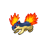

# Quilava

{ align=left }

| Information | Value |
|------------|--------|
| Name | Quilava |
| Category | Volcano Pokémon |
| Types | Fire |
| Gender Ratio | 50% Male |
| Catch Rate | 45 |

## Base Stats

| Stat | Value |
|------|-------|
| HP | 58 |
| Attack | 64 |
| Defense | 58 |
| Sp. Attack | 80 |
| Sp. Defense | 65 |
| Speed | 80 |
| BST | 405 |

## Abilities
1. Flash Fire

## Level Up Moves
| Level | Move |
|-------|------|
| 1 | Tackle |
| 1 | Leer |
| 1 | Mud-Slap |
| 6 | Mud-Slap |
| 12 | Ember |
| 21 | Quick Attack |
| 31 | Lava Plume |
| 36 | Scorching Sands |
| 40 | Flare Blitz |
| 51 | Eruption |

## Evolution
- Evolves from [Cyndaquil](155-cyndaquil.md) at level 14
- Evolves into [Typhlosion](157-typhlosion.md) at level 36

!!! note "Notable TMs"
    - TM01 (Focus Punch)
    - TM06 (Toxic)
    - TM28 (Dig)
    - TM31 (Brick Break)
    - TM35 (Flamethrower)
    - TM38 (Fire Blast)
    - TM40 (Aerial Ace)
    - TM44 (Rest)
    - TM50 (Overheat)
    - HM03 (Will-O-Wisp)
