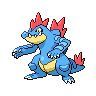

# Feraligatr

{ align=left }

| Information | Value |
|------------|--------|
| Name | Feraligatr |
| Category | Big Jaw Pokémon |
| Types | Water/Dark |
| Gender Ratio | 50% Male |
| Catch Rate | 45 |

## Base Stats

| Stat | Value |
|------|-------|
| HP | 85 |
| Attack | 113 |
| Defense | 100 |
| Sp. Attack | 75 |
| Sp. Defense | 83 |
| Speed | 78 |
| BST | 534 |

## Abilities
1. Intimidate

## Level Up Moves
| Level | Move |
|-------|------|
| 1 | Tackle |
| 1 | Leer |
| 1 | Aqua Jet |
| 1 | Fury Swipes |
| 7 | Aqua Jet |
| 13 | Flatter |
| 31 | Aqua Jet |
| 33 | Surf |
| 35 | Night Slash |
| 37 | Counter |
| 39 | Snarl |
| 41 | Fake Tears |
| 43 | Agility |
| 45 | Low Kick |
| 48 | High Horsepower |
| 51 | Dragon Dance |
| 55 | Superpower |
| 60 | Double-Edge |

## Evolution
- Evolves from [Croconaw](159-croconaw.md) at level 30

!!! note "Notable TMs"
    - TM01 (Focus Punch)
    - TM02 (Dragon Claw)
    - TM07 (Rock Slide)
    - TM13 (Ice Beam)
    - TM14 (Blizzard)
    - TM15 (Swords Dance)
    - TM21 (Scald)
    - TM26 (Earthquake)
    - TM28 (Dig)
    - TM31 (Brick Break)
    - TM39 (Rock Tomb)
    - TM44 (Rest)
    - TM49 (Bulldoze)
    - HM02 (Focus Blast)
    - HM04 (Icy Wind)
    - HM06 (Ice Punch)
