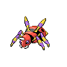

# Ariados

{ align=left }

| Information | Value |
|------------|--------|
| Name | Ariados |
| Category | Long Leg Pokémon |
| Types | Bug/Poison |
| Gender Ratio | 50% Male |
| Catch Rate | 90 |

## Base Stats

| Stat | Value |
|------|-------|
| HP | 70 |
| Attack | 115 |
| Defense | 70 |
| Sp. Attack | 70 |
| Sp. Defense | 70 |
| Speed | 80 |
| BST | 475 |

## Abilities
1. Swarm
2. Intimidate

## Level Up Moves
| Level | Move |
|-------|------|
| 1 | Poison Jab |
| 1 | String Shot |
| 1 | Scary Face |
| 1 | Leech Life |
| 6 | Scary Face |
| 11 | Shadow Sneak |
| 17 | Night Shade |
| 35 | Lunge |
| 37 | Shadow Sneak |
| 40 | Night Slash |
| 42 | Rage Powder |
| 45 | Leech Life |
| 48 | Agility |
| 51 | Bounce |
| 53 | Baton Pass |
| 57 | Smart Strike |
| 60 | Megahorn |

## Evolution
- Evolves from [Spinarak](167-spinarak.md) at level 22

!!! note "Notable TMs"
    - TM15 (Swords Dance)
    - TM18 (X-Scissor)
    - TM19 (Giga Drain)
    - TM22 (Solar Beam)
    - TM28 (Dig)
    - TM29 (Psychic)
    - TM32 (Poison Jab)
    - TM36 (Sludge Bomb)
    - TM44 (Rest)
    - TM46 (Thief)
