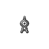

# Unown

{ align=left }

| Information | Value |
|------------|--------|
| Name | Unown |
| Category | Symbol Pokémon |
| Types | Psychic |
| Gender Ratio | Genderless |
| Catch Rate | 225 |

## Base Stats

| Stat | Value |
|------|-------|
| HP | 48 |
| Attack | 72 |
| Defense | 48 |
| Sp. Attack | 72 |
| Sp. Defense | 48 |
| Speed | 48 |
| BST | 336 |

## Abilities
1. Levitate

## Level Up Moves
| Level | Move |
|-------|------|
| 1 | Hidden Power |

## Evolution
- Does not evolve

## Egg Groups
- Undiscovered

!!! note "Notable TMs"
    - TM11 (Substitute)

!!! info "Special Notes"
    - Unown can only learn Hidden Power
    - There are 28 different forms of Unown, each representing a letter of the alphabet plus "!" and "?"
    - Each Unown's Hidden Power type and power is determined by its form
