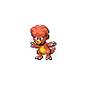

# Magby

{ align=left }

| Information | Value |
|------------|--------|
| Name | Magby |
| Category | Live Coal Pokémon |
| Types | Fire |
| Gender Ratio | 75% Male |
| Catch Rate | 45 |

## Base Stats

| Stat | Value |
|------|-------|
| HP | 45 |
| Attack | 75 |
| Defense | 37 |
| Sp. Attack | 70 |
| Sp. Defense | 55 |
| Speed | 83 |
| BST | 365 |

## Abilities
1. Flame Body

## Level Up Moves
| Level | Move |
|-------|------|
| 1 | Ember |
| 7 | Leer |
| 13 | Aura Sphere |
| 19 | Fire Punch |
| 25 | Roost |
| 31 | Sunny Day |
| 37 | Flamethrower |
| 43 | Confuse Ray |
| 49 | Fire Blast |

## Evolution
- Evolves into [Magmar](126-magmar.md) at level 30

## Egg Moves
- Snarl
- Zen Headbutt
- Barrier
- Screech
- Cross Chop
- Thunder Punch

## Egg Groups
- Undiscovered

## Wild Items
- Rawst Berry (100%)

!!! note "Notable TMs"
    - TM01 (Focus Punch)
    - TM20 (Power Up Punch)
    - TM29 (Psychic)
    - TM31 (Brick Break)
    - TM35 (Flamethrower)
    - TM38 (Fire Blast)
    - HM03 (Will-O-Wisp)
    - HM05 (Fire Punch)
    - HM07 (Thunder Punch)
    - HM08 (Helping Hand)
