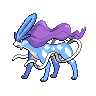

# Suicune

{ align=left }

| Information | Value |
|------------|--------|
| Name | Suicune |
| Category | Aurora Pokémon |
| Types | Water |
| Gender Ratio | Genderless |
| Catch Rate | 3 |

## Base Stats

| Stat | Value |
|------|-------|
| HP | 100 |
| Attack | 75 |
| Defense | 115 |
| Sp. Attack | 90 |
| Sp. Defense | 115 |
| Speed | 85 |
| BST | 580 |

## Abilities
1. Pressure
2. Inner Focus

## Level Up Moves
| Level | Move |
|-------|------|
| 1 | Crunch |
| 1 | Leer |
| 11 | Surf |
| 21 | Roar |
| 46 | Snarl |
| 47 | Air Slash |
| 48 | Weather Ball |
| 50 | Extrasensory |
| 51 | Hydro Pump |
| 53 | Signal Beam |
| 55 | Mirror Coat |
| 60 | Hydro Pump |
| 71 | Sheer Cold |

## Egg Groups
- Undiscovered

!!! note "Legendary Pokémon"
    Suicune is a Legendary Pokémon, one of the Legendary Beasts of Johto.

!!! note "Notable TMs"
    - TM04 (Calm Mind)
    - TM13 (Ice Beam)
    - TM14 (Blizzard)
    - TM21 (Scald)
    - TM28 (Dig)
    - TM33 (Reflect)
    - TM44 (Rest)
    - TM49 (Bulldoze)
    - HM04 (Icy Wind)
