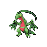

# Grovyle

{ align=left }

| Information | Value |
|------------|--------|
| Name | Grovyle |
| Category | Wood Gecko Pokémon |
| Types | Grass/Dragon |
| Gender Ratio | 87.5% Male |
| Catch Rate | 45 |

## Base Stats

| Stat | Value |
|------|-------|
| HP | 50 |
| Attack | 65 |
| Defense | 45 |
| Sp. Attack | 85 |
| Sp. Defense | 65 |
| Speed | 95 |
| BST | 405 |

## Abilities
1. Lightning Rod

## Level Up Moves
| Level | Move |
|-------|------|
| 1 | Mega Drain |
| 1 | Leer |
| 1 | Quick Attack |
| 1 | Twister |
| 6 | Pursuit |
| 11 | Screech |
| 26 | Mega Drain |
| 29 | Fury Cutter |
| 31 | Dragon Pulse |
| 33 | Leech Seed |
| 35 | Dragon Dance |
| 37 | Night Slash |
| 38 | Leaf Blade |
| 40 | Dragon Claw |
| 42 | Synthesis |
| 44 | Drain Punch |
| 47 | Energy Ball |
| 51 | Draco Meteor |
| 54 | Leaf Storm |

## Evolution
- Evolves from [Treecko](252-treecko.md) at level 16
- Evolves into Sceptile at level 36

## Egg Groups
- Monster
- Dragon

!!! note "Notable TMs"
    - TM01 (Focus Punch)
    - TM07 (Rock Slide)
    - TM15 (Swords Dance)
    - TM18 (X-Scissor)
    - TM19 (Giga Drain)
    - TM20 (Power-Up Punch)
    - TM22 (Solar Beam)
    - TM28 (Dig)
    - TM31 (Brick Break)
    - TM37 (Energy Ball)
    - TM39 (Rock Tomb)
    - TM40 (Aerial Ace)
    - HM07 (Thunder Punch)
