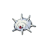

# Silcoon

{ align=left }

| Information | Value |
|------------|--------|
| Name | Silcoon |
| Category | Cocoon Pokémon |
| Types | Bug |
| Gender Ratio | 50% Male |
| Catch Rate | 120 |

## Base Stats

| Stat | Value |
|------|-------|
| HP | 50 |
| Attack | 35 |
| Defense | 55 |
| Sp. Attack | 25 |
| Sp. Defense | 25 |
| Speed | 15 |
| BST | 205 |

## Abilities
1. Shed Skin

## Level Up Moves
| Level | Move |
|-------|------|
| 1 | Harden |
| 7 | Harden |

## Evolution
- Evolves from [Wurmple](265-wurmple.md) at level 7 (based on personality value)
- Evolves into Beautifly at level 10

## Egg Groups
- Bug
