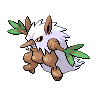

# Shiftry

{ align=left }

| Information | Value |
|------------|--------|
| Name | Shiftry |
| Category | Wicked Pokémon |
| Types | Grass / Dark |
| Gender Ratio | 50% Male |
| Catch Rate | 45 |

## Base Stats

| Stat | Value |
|------|-------|
| HP | 90 |
| Attack | 110 |
| Defense | 60 |
| Sp. Attack | 90 |
| Sp. Defense | 60 |
| Speed | 90 |
| BST | 500 |

## Abilities
1. Chlorophyll
2. Insomnia

## Level Up Moves
| Level | Move |
|-------|------|
| 1 | Dark Pulse |
| 1 | Harden |
| 1 | Growth |
| 1 | Nature Power |
| 1 | Snarl |
| 34 | Torment |
| 34 | Faint Attack |
| 34 | Air Cutter |
| 36 | Extrasensory |
| 39 | Dark Pulse |
| 39 | Night Slash |
| 41 | Air Slash |
| 41 | Bounce |
| 43 | Heat Wave |
| 45 | Leaf Blade |
| 47 | Knock Off |
| 48 | Hurricane |
| 50 | Leaf Storm |
| 60 | Explosion |

## Evolution
- Evolves from [Nuzleaf](274-nuzleaf.md) at level 40

## Egg Groups
- Field
- Grass

!!! note "Notable TMs"
    - TM05 (Dark Pulse)
    - TM07 (Rock Slide)
    - TM15 (Swords Dance)
    - TM18 (X-Scissor)
    - TM19 (Giga Drain)
    - TM20 (Power-Up Punch)
    - TM22 (Solar Beam)
    - TM28 (Dig)
    - TM30 (Shadow Ball)
    - TM31 (Brick Break)
    - TM37 (Energy Ball)
    - TM39 (Rock Tomb)
    - TM40 (Aerial Ace)
    - HM02 (Focus Blast)
    - HM04 (Icy Wind)
