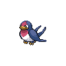

# Taillow

{ align=left }

| Information | Value |
|------------|--------|
| Name | Taillow |
| Category | Tiny Swallow Pokémon |
| Types | Normal / Flying |
| Gender Ratio | 50% Male |
| Catch Rate | 200 |

## Base Stats

| Stat | Value |
|------|-------|
| HP | 40 |
| Attack | 55 |
| Defense | 30 |
| Sp. Attack | 30 |
| Sp. Defense | 30 |
| Speed | 85 |
| BST | 270 |

## Abilities
1. Guts

## Level Up Moves
| Level | Move |
|-------|------|
| 1 | High Horsepower |
| 1 | Growl |
| 4 | Focus Energy |
| 8 | Quick Attack |
| 13 | Dual Wingbeat |
| 19 | Double Team |
| 26 | Endeavor |
| 34 | Aerial Ace |
| 43 | Agility |

## Evolution
- Evolves into Swellow at level 22

## Egg Groups
- Flying

## Egg Moves
- Pursuit
- Iron Head
- Refresh
- Mirror Move
- Dragon Pulse
- Psyshield Bash

!!! note "Notable TMs"
    - TM40 (Aerial Ace)
    - TM41 (Roost)
    - TM47 (Steel Wing)
