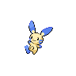

# Minun

{ align=left }

| Information | Value |
|------------|--------|
| Name | Minun |
| Category | Cheering Pokémon |
| Types | Electric/Fairy |
| Gender Ratio | 50% Male |
| Catch Rate | 200 |

## Base Stats

| Stat | Value |
|------|-------|
| HP | 60 |
| Attack | 40 |
| Defense | 50 |
| Sp. Attack | 90 |
| Sp. Defense | 85 |
| Speed | 115 |
| BST | 440 |

## Abilities
1. Minus

## Level Up Moves
| Level | Move |
|-------|------|
| 1 | Fake Tears |
| 4 | Thunder Wave |
| 10 | Quick Attack |
| 13 | Helping Hand |
| 19 | Discharge |
| 22 | Encore |
| 28 | Agility |
| 31 | Charge |
| 36 | Signal Beam |
| 37 | Baton Pass |
| 40 | Thunder |
| 43 | Moonblast |
| 46 | Wish |
| 48 | Nasty Plot |
| 51 | Grass Knot |

## Egg Groups
- Fairy

## Egg Moves
- Substitute
- Wish

!!! note "Notable TMs"
    - TM16 (Light Screen)
    - TM24 (Thunderbolt)
    - TM25 (Thunder)
    - TM34 (Thunder Wave)
    - TM45 (Dazzling Gleam)
    - HM07 (Thunder Punch)
    - HM08 (Helping Hand)
