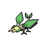

# Vibrava

{ align=left }

| Information | Value |
|------------|--------|
| Name | Vibrava |
| Category | Vibration Pokémon |
| Types | Ground/Dragon |
| Gender Ratio | 50% Male |
| Catch Rate | 120 |

## Base Stats

| Stat | Value |
|------|-------|
| HP | 50 |
| Attack | 70 |
| Defense | 50 |
| Sp. Attack | 50 |
| Sp. Defense | 50 |
| Speed | 70 |
| BST | 340 |

## Abilities
1. Levitate

## Level Up Moves
| Level | Move |
|-------|------|
| 1 | Bite |
| 1 | Mud-Slap |
| 1 | Faint Attack |
| 1 | Sand Tomb |
| 9 | Mud-Slap |
| 17 | Faint Attack |
| 25 | Bug Buzz |
| 33 | Crunch |
| 35 | DragonBreath |
| 38 | Earth Power |
| 42 | Crunch |
| 45 | Sandstorm |
| 49 | Dual Wingbeat |
| 52 | Earthquake |
| 56 | Boomburst |
| 61 | Superpower |
| 65 | Dragon Dance |
| 70 | Draco Meteor |

## Evolution
- Evolves from [Trapinch](328-trapinch.md) at level 35
- Evolves into Flygon at level 45

## Egg Groups
- Bug

!!! note "Notable TMs"
    - TM07 (Rock Slide)
    - TM19 (Giga Drain)
    - TM22 (Solar Beam)
    - TM26 (Earthquake)
    - TM28 (Dig)
    - TM39 (Rock Tomb)
    - TM41 (Roost)
    - TM47 (Steel Wing)
    - TM49 (Bulldoze)
