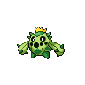

# Cacnea

{ align=left }

| Information | Value |
|------------|--------|
| Name | Cacnea |
| Category | Cactus Pokémon |
| Types | Grass |
| Gender Ratio | 50% Male |
| Catch Rate | 190 |

## Base Stats

| Stat | Value |
|------|-------|
| HP | 50 |
| Attack | 85 |
| Defense | 40 |
| Sp. Attack | 85 |
| Sp. Defense | 40 |
| Speed | 35 |
| BST | 335 |

## Abilities
1. Sand Veil
2. Water Absorb

## Level Up Moves
| Level | Move |
|-------|------|
| 1 | Dazzling Gleam |
| 1 | Leer |
| 5 | Power Whip |
| 9 | Growth |
| 13 | Leech Seed |
| 17 | Sand-Attack |
| 21 | Pin Missile |
| 25 | Ingrain |
| 29 | Faint Attack |
| 33 | Spikes |
| 37 | Wood Hammer |
| 41 | Cotton Spore |
| 45 | Sandstorm |

## Evolution
- Evolves into Cacturne at level 32

## Egg Groups
- Grass
- Human-Like

## Egg Moves
- Grass Whistle
- Acid
- Teeter Dance
- Dynamic Punch
- Counter

## Held Items
- Wild: Poison Barb (rare)

!!! note "Notable TMs"
    - TM01 (Focus Punch)
    - TM05 (Dark Pulse)
    - TM15 (Swords Dance)
    - TM19 (Giga Drain)
    - TM20 (Power-Up Punch)
    - TM22 (Solar Beam)
    - TM31 (Brick Break)
    - TM32 (Poison Jab)
    - TM37 (Energy Ball)
    - HM07 (Thunder Punch)
