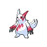

# Zangoose

{ align=left }

| Information | Value |
|------------|--------|
| Name | Zangoose |
| Category | Cat Ferret Pokémon |
| Types | Normal |
| Gender Ratio | 50% Male |
| Catch Rate | 90 |

## Base Stats

| Stat | Value |
|------|-------|
| HP | 73 |
| Attack | 115 |
| Defense | 60 |
| Sp. Attack | 60 |
| Sp. Defense | 80 |
| Speed | 90 |
| BST | 478 |

## Abilities
1. Immunity

## Level Up Moves
| Level | Move |
|-------|------|
| 1 | Triple Axel |
| 4 | Leer |
| 7 | Quick Attack |
| 10 | Swords Dance |
| 13 | Fury Cutter |
| 19 | Slash |
| 25 | Pursuit |
| 31 | Sludge Wave |
| 37 | Taunt |
| 46 | Brave Bird |
| 55 | False Swipe |

## Egg Groups
- Field

## Egg Moves
- Flail
- Double Kick
- Boomburst
- Counter
- Roar
- Curse

!!! note "Notable TMs"
    - TM01 (Focus Punch)
    - TM13 (Ice Beam)
    - TM14 (Blizzard)
    - TM15 (Swords Dance)
    - TM18 (X-Scissor)
    - TM20 (Power-Up Punch)
    - TM23 (Shadow Claw)
    - TM24 (Thunderbolt)
    - TM31 (Brick Break)
    - TM32 (Poison Jab)
    - TM35 (Flamethrower)
    - TM38 (Fire Blast)
    - HM02 (Focus Blast)
    - HM05 (Fire Punch)
    - HM06 (Ice Punch)
    - HM07 (Thunder Punch)
