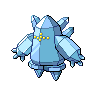

# Regice

{ align=left }

| Information | Value |
|------------|--------|
| Name | Regice |
| Category | Iceberg Pokémon |
| Types | Ice |
| Gender Ratio | Genderless |
| Catch Rate | 3 |

## Base Stats

| Stat | Value |
|------|-------|
| HP | 80 |
| Attack | 50 |
| Defense | 100 |
| Sp. Attack | 115 |
| Sp. Defense | 185 |
| Speed | 50 |
| BST | 580 |

## Abilities
1. Clear Body

## Level Up Moves
| Level | Move |
|-------|------|
| 1 | Explosion |
| 9 | Icy Wind |
| 17 | Curse |
| 25 | Superpower |
| 33 | Ancient Power |
| 46 | Hail |
| 48 | Agility |
| 51 | Lock-On |
| 51 | Zap Cannon |
| 60 | Explosion |
| 71 | Sheer Cold |

## Egg Groups
- Undiscovered

!!! note "Notable TMs"
    - TM01 (Focus Punch)
    - TM07 (Rock Slide)
    - TM13 (Ice Beam)
    - TM14 (Blizzard)
    - TM20 (Power Up Punch)
    - TM24 (Thunderbolt)
    - TM25 (Thunder)
    - TM26 (Earthquake)
    - TM31 (Brick Break)
    - TM39 (Rock Tomb)
    - TM43 (Flash Cannon)
    - TM49 (Bulldoze)
    - HM02 (Focus Blast)
    - HM04 (Icy Wind)
    - HM06 (Ice Punch)
    - HM07 (Thunder Punch)
